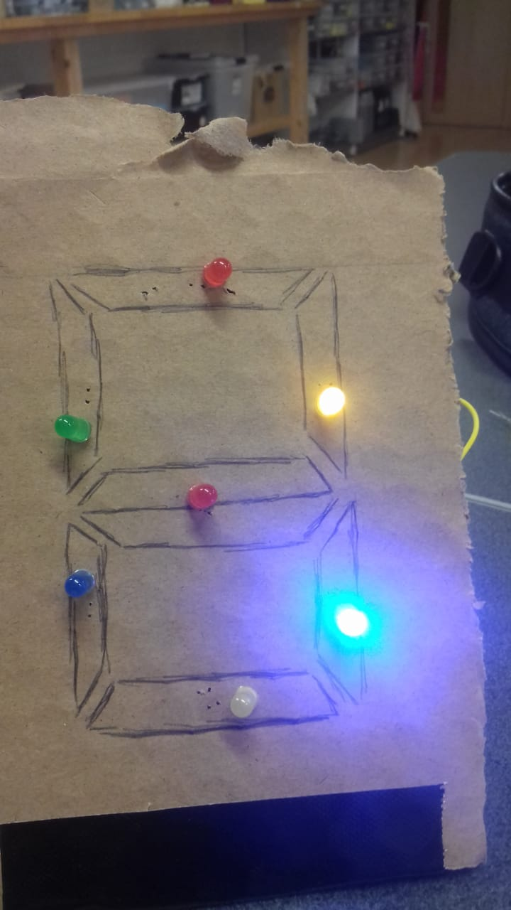
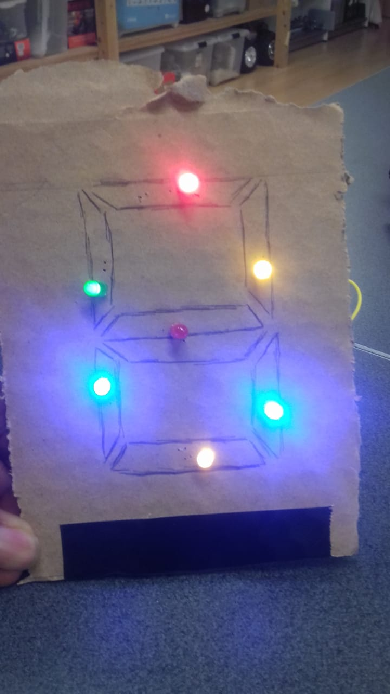

# •Communication• Morse code and Binary code UNIT2 Project
-------------------------------------------------------------
# KelvenManuel 


Communication between the Earth the moon and Mars using Arduino 

Contents
---------
  1. [planning](#Planning)
  2. [Design](#Design)
  3. [Development](#Development)
  4. [Evaluation](#Evaluation)
  
 1.Planning 
 -------------
 
 ### Definition of the Problem 
 In 2050, The company Explore wants to explore other planets, on the other hand, the communication nowadays still uncertain. they have 3 station one in the Earth that can only communicate using Morse code, the second station in the Moon can only communicate in Binary and the final station in Mars that they need us to provide a channel of communication. 
 
 ### Proposed Solution 
 
 ### success criteria
 
 • Communication between the 2 station Earth and Mars using Morse code; 
 • Communication between Mars and the Moon uses Binary code;
 • find a communication system that allow stations to communicate completely using English 
 • Keyboard input on each station is limited to 2push buttons. 
 • 100W lights are buzzers are available 
 
 
 2.Desing
 ----------
# Traffic lights system 


```.sh
void setup()
{
  pinMode(13, OUTPUT);
  pinMode(12, OUTPUT);
  pinMode(11, OUTPUT);
}

void loop()
{
  digitalWrite(13, HIGH);
  delay(1000); // Wait for 1000 millisecond(s)
  digitalWrite(13, LOW);
  delay(1000); // Wait for 1000 millisecond(s)
  digitalWrite(12, HIGH);
  delay(1000); // Wait for 500 millisecond(s)
  digitalWrite(12, LOW);
  delay(1000); // Wait for 500 millisecond(s)
  digitalWrite(11, HIGH);
  delay(1000); // Wait for 1000 millisecond(s)
  digitalWrite(11, LOW);
  delay(1000); // Wait for 1000 millisecond(s)
}
```


# cabes system using Arduino to turn on the light 


```.sh
 int ledPin[] = {13,12,11,10,9,8};
// an arry to define the pins

void setup()
{
  for (int i = 0; i < 5; i++)
  {
    pinMode(ledPin[i], OUTPUT);
  }
}

void loop()
{
  for (byte counter = 0; counter <= 32; counter++)
  {
    displayBinary(counter);
    delay(2000);
  }
}

void displayBinary(byte num)
{
  for (int i = 0; i < 5; i++)
  {
    if (bitRead(num, i)==1)
    {
      digitalWrite(ledPin[i], HIGH);
    }
    else
    {
      digitalWrite(ledPin[i], LOW);
    }
  }

}
```


# Using Arduino,coding and lights to build a segment display 



```.sh 
int butA = 13;
int butB = 12;
int butC = 11;
int out1 = 10;
int out2 = 9;
int out3 = 8;
int out4 = 7;
int out5 = 6;
int out6 = 5;
int out7 = 4;
  
void setup()
{
  pinMode(butA, INPUT);
  pinMode(butB, INPUT);
  pinMode(butC, INPUT);
  pinMode(out1, OUTPUT);
  pinMode(out2, OUTPUT);
  pinMode(out3, OUTPUT);
  pinMode(out4, OUTPUT);
  pinMode(out5, OUTPUT);
  pinMode(out6, OUTPUT);
  pinMode(out7, OUTPUT);
 
}

void loop()
{
  bool A = digitalRead(butA);
  bool B = digitalRead(butB);
  bool C = digitalRead(butC);
  
  bool eq1 = B || (!A && !C) || (A && C);
  digitalWrite(out1, eq1);
  
  bool eq2 = !A || (C && B) || (!B && !C);
  digitalWrite(out2, eq2);
  
  bool eq3 = (!A && !B) || C || (A && !C);
  digitalWrite(out3, eq3);
  
  bool eq4 = (!A && !C) || (!A && B) || (B && !C) || (A && !B && C);
  digitalWrite(out4, eq4);
  
  bool eq5 = (!A && !C) || (!A && !B);
  digitalWrite(out5, eq5);
  
  bool eq6 = (A && !B) || !C;
  digitalWrite(out6, eq6);
  
  bool eq7 = (A && !C);
  digitalWrite(out7, eq7);
  
}
```

 
 3.Development 
 --------------
 
 # First steps about Binary code ( binary to decimal conversion ) 
 ```.sh 
 count base 8 binary    count base 4 binary       desimal 15 to Binary 
 
  n%8                    n%4                      num   A    B    C    D 
  
   0                      0                        0    0    0    0    0
   1                      1                        1    0    0    0    1
   2                      2                        2    0    0    1    0
   3                      3                        3    0    0    1    1 
   4                      0                        4    0    1    0    0
   5                      1                        5    0    1    0    1 
   6                      2                        6    0    1    1    0
   7                      3                        7    0    1    1    1
   0                      0                        8    1    0    0    0 
   1                      1                        9    1    0    0    1
   2                      2                        10   1    0    1    0 
   3                      3                        11   1    0    1    1 
   4                      0                        12   1    1    0    0
   5                      1                        13   1    1    0    1
   6                      2                        14   1    1    1    0 
   7                      3                        15   1    1    1    1 
   
                                                       bit  bit  bit  bit 
                                                        3    2    1    0 
```
What is Usability?
A: Usability is the part of the user experience[1], process of designing a product with the user in mind[2]. Degree of earse that a product can be used to attain the proposed goal. 

### Principles of desgn 
• Discoverability
• Feedback 


[3] Posner J, Mars R. " It is not you. Bad doors are everywhere". 2016.Retrieved on 25th nov 19.
   
 4.Evaluation 
 --------------
 
 
 
### 


